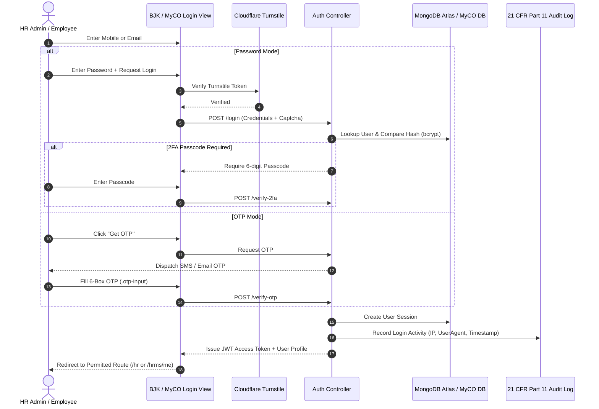
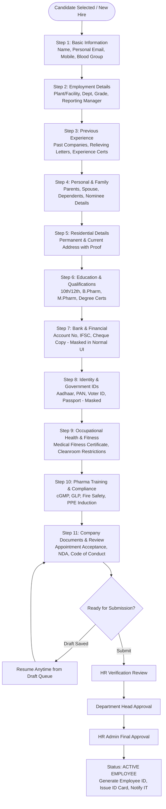
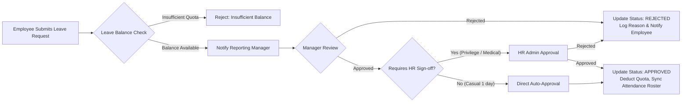
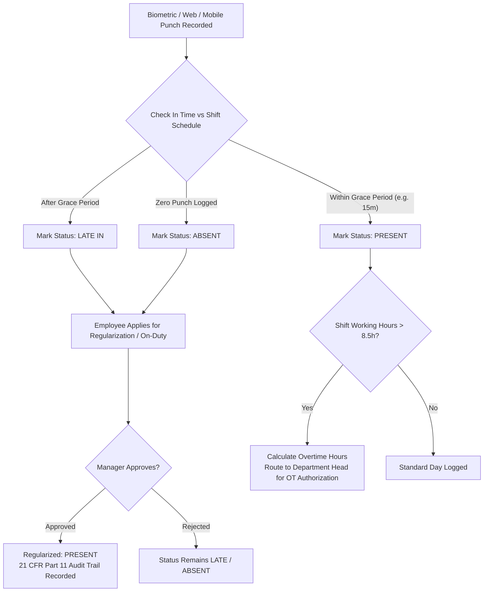
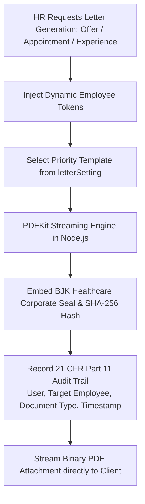

# MyCO HRMS Reference System — Operational Workflow Map

**Scope:** Business workflows, state transitions, validation checks, and multi-tier approval processes.  
**Reference Source:** MyCO runtime audit and standard pharmaceutical HR lifecycle specifications.

---

## 1. Authentication & Security Access Workflow

---

## 2. Employee Onboarding & Lifecycle Workflow

---

## 3. Leave Application & Approval Workflow

---

## 4. Attendance Regularization & Overtime Workflow

---

## 5. Document & Letter Generation Workflow (`pdfService.js`)

